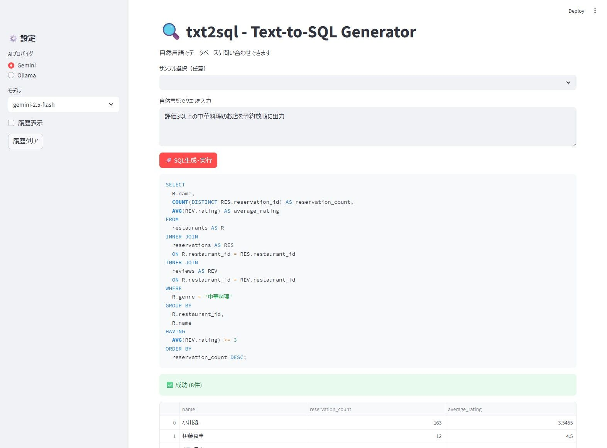

# txt2sql - AI-Powered Text-to-SQL Generator

**自然言語でデータベースクエリを実行できるStreamlitアプリケーション**


---

## 📖 このアプリでできること

txt2sqlは、**自然言語からSQLを生成してデータベースを閲覧**できるWebアプリケーションです。



- 「30代の会員は何人？」→ 自動でSQLを生成して実行
- 「評価4以上のイタリアンレストラン一覧」→ 結果を表形式で表示
- エラーが出ても自動で修正を試みます（最大3回）
- 結果はCSVでダウンロード可能

---

## 🖥️ 動作環境

### 必須要件

- **Google Gemini APIキー**（無料で取得可能、詳細は[セットアップ手順](#ステップ5-gemini-apiキーの取得と設定)参照）

### 動作確認済み環境

- **OS**: Ubuntu 24.04 LTS、Windows 11
- **Python**: 3.10以上（開発環境: Python 3.13.5）
- **ブラウザ**: Chrome, Firefox, Edge, Safari（最新版推奨）

### 使用可能なAIモデル

**Gemini**:
- gemini-2.5-flash（デフォルト、高速）
- gemini-2.5-pro（高精度）
- gemini-2.5-flash-lite（超高速）

**Ollama（試験的機能）**:
- gemma3:12b / gemma3:27b / gpt-oss:latest
- ⚠️ 自前でOllamaサーバーを構築し、対象モデルをダウンロード済みの場合のみ利用可能
- `.env` に `OLLAMA_BASE_URL` を設定すれば使用できます

### 未検証の環境

以下の環境では動作未確認です（動く可能性はあります）:
- Windows 10
- macOS
- WSL (Windows Subsystem for Linux)

### Windows環境での注意事項

Windowsでは `python3` ではなく `python` コマンドを使用します:
- ✅ 正: `python -m venv venv`
- ❌ 誤: `python3 -m venv venv`

---

## 🚀 セットアップ手順（5分）

### ステップ1: 前提条件の確認

#### 1-1. Pythonのバージョン確認

ターミナルで以下を実行:

```bash
python3 --version
```

**期待される出力例**: `Python 3.10.0` 以上

- ✅ 3.10以上が表示された → 次へ進む
- ❌ 3.9以下 または コマンドが見つからない → [Python 3.10がインストールされていない](#python-310がインストールされていない)へ

#### 1-2. pipの確認

```bash
pip3 --version
```

**期待される出力例**: `pip 21.0` 以上

- ✅ バージョンが表示された → 次へ進む
- ❌ コマンドが見つからない → [pipがインストールされていない](#pipがインストールされていない)へ

---

### ステップ2: リポジトリのクローン

```bash
git clone https://github.com/yo2158/txt2sql.git
cd txt2sql
```

**確認**: `ls` を実行して `app.py` `requirements.txt` などが表示されればOK

---

### ステップ3: 仮想環境の作成（推奨）

**Ubuntu/macOS**:
```bash
python3 -m venv venv
source venv/bin/activate
```

**Windows**:
```cmd
python -m venv venv
venv\Scripts\activate
```

**確認**: プロンプトの先頭に `(venv)` が表示されればOK

**仮想環境を終了したい場合**:
```bash
deactivate
```

---

### ステップ4: 依存パッケージのインストール

```bash
pip install -r requirements.txt
```

**所要時間**: 約1-2分

**確認**: エラーなく完了すれば OK（警告は無視して構いません）

---

### ステップ5: Gemini APIキーの取得と設定

#### 5-1. APIキーの取得（無料）

1. [Google AI Studio](https://aistudio.google.com/app/apikey) にアクセス
2. Googleアカウントでログイン
3. 「**Get API key**」→「**Create API key in new project**」をクリック
4. 生成されたAPIキーをコピー（`AIza...` で始まる文字列）

**無料枠について**:
- Google AI Studioで取得したAPIキーは無料枠で利用可能です
- 制限を超えるとエラーが返されますが、自動課金はされません
- 最新の料金・制限情報は[公式サイト](https://ai.google.dev/pricing)で必ず確認してください

**APIキーの取り扱い**:
- ⚠️ **APIキーは絶対に公開しないでください**（GitHubなどにアップロード厳禁）

#### 5-2. 環境変数ファイルの作成

```bash
cp .env.example .env
```

#### 5-3. APIキーの設定

`.env` ファイルをテキストエディタで開き、以下の行を編集:

```env
GEMINI_API_KEY=your_gemini_api_key_here
```

↓

```env
GEMINI_API_KEY=AIzaSyC... （コピーしたAPIキーに置き換え）
```

**保存して閉じてください。**

---

### ステップ6: アプリケーションの起動

```bash
streamlit run app.py
```

**期待される出力**:
```
You can now view your Streamlit app in your browser.

  Local URL: http://localhost:8501
  Network URL: http://192.168.x.x:8501
```

ブラウザが自動で開きます。開かない場合は `http://localhost:8501` にアクセスしてください。

**初回起動時**: メールアドレスの入力を求められることがあります。何も入力せずEnterキーを押せばスキップできます。

**確認**: 画面に「🔍 txt2sql - Text-to-SQL Generator」と表示されればOK

---

## 💡 使い方

### 基本的な使い方

1. **テキストエリアに質問を入力**

   例: 「30代の会員は何人いますか？」

2. **「🚀 SQL生成・実行」ボタンをクリック**

3. **結果を確認**
   - 生成されたSQLクエリが表示されます
   - クエリ実行結果が表形式で表示されます（最大1000件）
   - 結果をCSVでダウンロードできます

### サンプルクエリ

アプリ内のドロップダウンから選択できます:

- 「30代の会員は何人いますか？」
- 「評価4以上のイタリアンレストランを表示」
- 「2025年1月に最も予約が多かった店舗TOP5」
- 「休眠会員（90日以上予約なし）は何人？」

### エラーが出た場合

- アプリが自動で修正を試みます（最大3回）
- データベースに関係ない質問（例: 「今日の天気は？」）は拒否されます

---

## 📊 データセット

アプリには**レストラン予約サービスのサンプルデータ**（33,600レコード）が含まれています。

| テーブル | レコード数 | 内容 |
|---------|-----------|------|
| members | 1,000件 | 会員情報（年齢、性別等） |
| restaurants | 200件 | 飲食店情報（店名、ジャンル等） |
| reservations | 4,000件 | 予約履歴 |
| access_logs | 25,000件 | アクセス履歴 |
| reviews | 400件 | レビュー（1-5点評価） |
| favorites | 3,000件 | お気に入り登録 |

詳細は [data/README.md](data/README.md) を参照してください。

---

## 🛠️ トラブルシューティング

### Gitがインストールされていない

**Windows**:
1. [Git for Windows公式サイト](https://git-for-windows.org/)にアクセス
2. 「Download」ボタンをクリックしてインストーラーをダウンロード
3. ダウンロードした `.exe` ファイルをダブルクリック
4. **重要な設定項目**:
   - **Adjusting your PATH environment**: 「Git from the command line and also from 3rd-party software」を選択（デフォルト）
   - その他の設定: すべてデフォルトのまま「Next」で進めてOK
5. インストール完了後、コマンドプロンプト/PowerShellを新しく開いて確認:
   ```cmd
   git --version
   ```
   バージョンが表示されればOK

**Ubuntu/Debian**:
```bash
sudo apt update
sudo apt install git
```

**macOS (Homebrew)**:
```bash
brew install git
```

### Python 3.10がインストールされていない

**Ubuntu/Debian**:
```bash
sudo apt update
sudo apt install python3.10 python3.10-venv python3-pip
```

**macOS (Homebrew)**:
```bash
brew install python@3.10
```

**Windows**:
1. [Python公式サイト](https://www.python.org/downloads/)から最新版（3.10以上）をダウンロード
2. ダウンロードした `.exe` ファイルをダブルクリック
3. **【最重要】** インストーラー起動時の最初の画面で、下部にある **`Add python.exe to PATH`** に必ずチェックを入れる
   - ⚠️ このチェックを忘れると `python` コマンドが使えません
4. **`Install Now`** をクリック（pipも自動的にインストールされます）
5. 「Setup was successful」と表示されたら完了
6. **インストール完了後、開いているコマンドプロンプト/PowerShellをすべて閉じて、新しく開く**
7. 確認:
   ```cmd
   python --version
   pip --version
   ```
   両方ともバージョンが表示されればOK

### pipがインストールされていない

```bash
# Ubuntu/Debian
sudo apt install python3-pip

# macOS (通常はPythonに同梱)
python3 -m ensurepip --upgrade
```

**Windows**: Python公式インストーラーから入れたPythonには通常pipが含まれています。

### "No module named 'streamlit'" エラー

仮想環境がアクティブか確認:

```bash
# 仮想環境をアクティブ化
source venv/bin/activate  # Windows: venv\Scripts\activate

# 再度インストール
pip install -r requirements.txt
```

### Gemini APIエラー

以下を確認してください:

1. `.env` ファイルが存在するか: `ls -la .env`
2. APIキーが正しく設定されているか: `.env` をエディタで開いて確認
3. APIキーが有効か: [Google AI Studio](https://aistudio.google.com/app/apikey)で確認

### ブラウザが起動しない

手動で `http://localhost:8501` にアクセスしてください。

---

## 📁 プロジェクト構造

```
txt2sql/
├── app.py                    # メインアプリケーション
├── requirements.txt          # 依存パッケージリスト
├── .env.example              # 環境変数テンプレート
├── README.md                 # このファイル
├── LICENSE                   # MITライセンス
│
├── src/                      # ソースコード
│   ├── config.py             # 設定管理
│   ├── prompt_generator.py   # AI用プロンプト生成
│   ├── ai_connector.py       # AI API接続
│   ├── sql_executor.py       # SQL実行エンジン
│   ├── sql_parser.py         # SQL抽出
│   └── error_handler.py      # エラー処理
│
├── data/                     # データセット
│   ├── restaurant.db         # SQLiteデータベース（4.6MB）
│   └── README.md             # データセット説明
│
└── dataset/                  # データ生成スクリプト
    ├── generate_data.py      # データベース生成
    ├── config.py             # 生成設定
    └── README.md             # 生成方法説明
```

---

## 🔧 技術スタック

- **Python 3.10+**: プログラミング言語
- **Streamlit**: UIフレームワーク
- **SQLite**: データベース
- **Google Gemini API**: AI（SQL生成）

---

## 📄 ライセンス

このプロジェクトはMITライセンスで公開されています。
詳細は [LICENSE](LICENSE) ファイルを参照してください。

---

## 📞 質問・不具合報告

[Issues](https://github.com/yo2158/txt2sql/issues) まで

---

**更新日**: 2025-10-01
**バージョン**: 1.0.0
